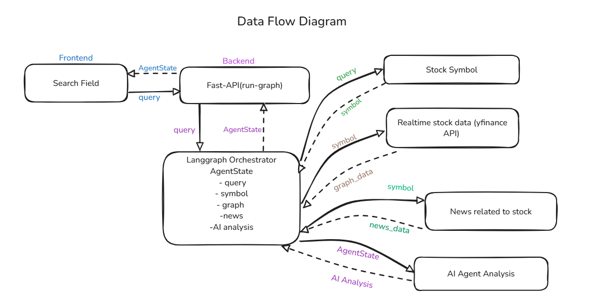

# Stock-Sense

Stock-Sense is an intelligent stock analysis platform that provides real-time market insights, news analysis, and AI-driven recommendations. The system combines technical analysis with natural language processing to deliver comprehensive stock market intelligence.

### System Architecture



## Features

- Real-time stock price and volume analysis
- News sentiment analysis
- AI-powered stock recommendations
- Interactive dashboard with Streamlit
- RESTful API backend with FastAPI
- Comprehensive technical analysis

## Tech Stack

- **Frontend**: Streamlit, Plotly
- **Backend**: FastAPI, Python
- **Data Processing**: pandas, yfinance
- **AI/ML**: LangChain, Langgraph, OpenAI and Gemini

## Setup and Installation

1. Clone the repository:
```bash
git clone https://github.com/yourusername/Stock-Sense.git
cd Stock-Sense
```

2. Install dependencies:
```bash
pip install -r requirements.txt
```

3. Set up environment variables:
```bash
# Create a .env file and add your API keys
OPENAI_API_KEY=your_openai_api_key
GOOGLE_API_KEY=your_google_api_key
FINNHUB_API_KEY=your_finnhub_api_key
```

## Running the Application

### Backend
1. Start the FastAPI server:
```bash
uvicorn main:app --reload --port 8000
```
The backend API will be available at `http://localhost:8000`

You can access the API documentation at:
- Swagger UI: `http://localhost:8000/docs`

### Frontend
1. Start the Streamlit dashboard:
```bash
streamlit run app.py
```
The dashboard will be available at `http://localhost:8501`

## API Endpoints

- `POST /run-graph`: Main endpoint for stock analysis
  - Input: Query string for stock/company analysis
  - Output: Comprehensive analysis including price data, volume data, news, and AI recommendations

## Project Structure

```
Stock-Sense/
├── app.py              # Streamlit frontend
├── main.py            # FastAPI backend
├── graph_workflow.py  # Main analysis workflow
├── pydantic_class.py  # Data models
├── requirements.txt   # Project dependencies
└── README.md         # Project documentation
```

## License

This project is licensed under the MIT License - see the LICENSE file for details.
